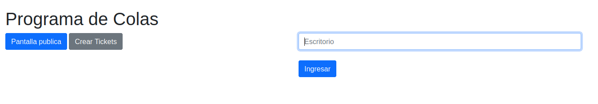
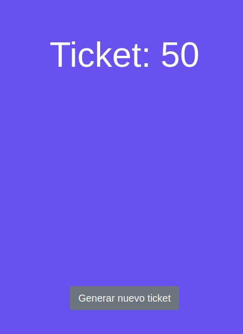
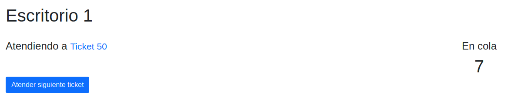
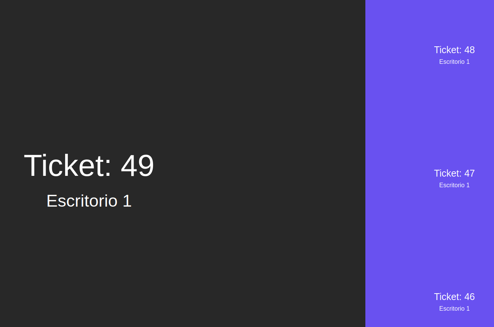

# Socket Colas de tickets

[](https://nodejs.org/es/)
[](https://curso-node-socket-colas-avm.herokuapp.com/)

Otra aplicación del curso de Node.

En este caso, se trata de una aplicación simple de colas de tickets que usará socket.

Recuerden que se debe ejecutar ```npm install ``` para reconstruir los módulos de Node.

#### Capturas







